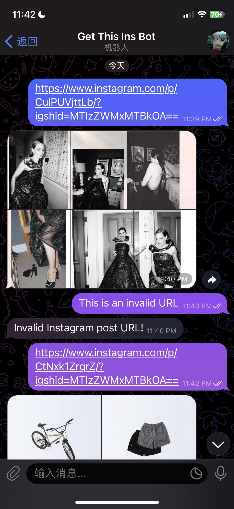

# Get This Ins Telegram Bot

A Telegram bot for retrieving media contents from instagram posts

## Showcase

## Features

1. Retrieve single image from an Instagram post
2. Retrieve multiple images from an Instagram post

## Requirements

To run this project on your local machine, you need to have：

- OpenJDK 20 or above
- Maven
- Telegram bot token
- Telegram bot username

## Setup

To run this project on your local machine:

1. Clone this repository
2. Install dependencies with `mvn install`
3. Apply for a Telegram bot token and username from [BotFather](https://t.me/botfather)
4. Change the `token` and `botUsername` in `src/main/java/bots/MyBot.java` to your own
5. Run `mvn compile exec:java` to start the bot
6. Go to your Telegram bot and send an Instagram post URL to start using the bot

## Usage

Send an Instagram post URL to the telegram bot, and the bot will send you the media contents in the post.